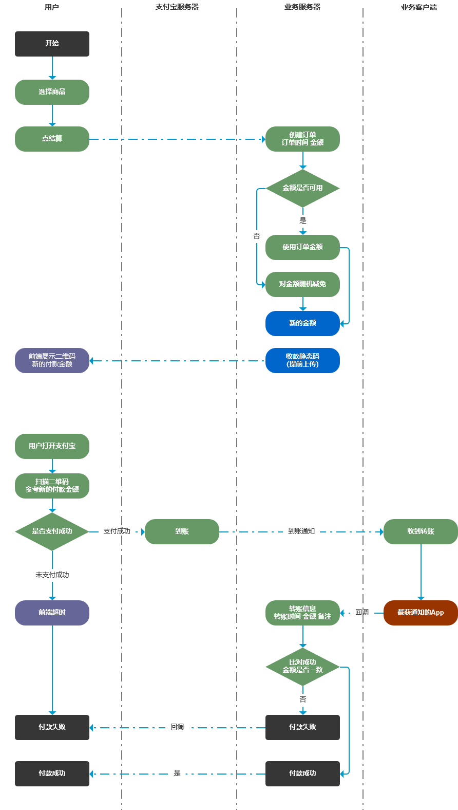
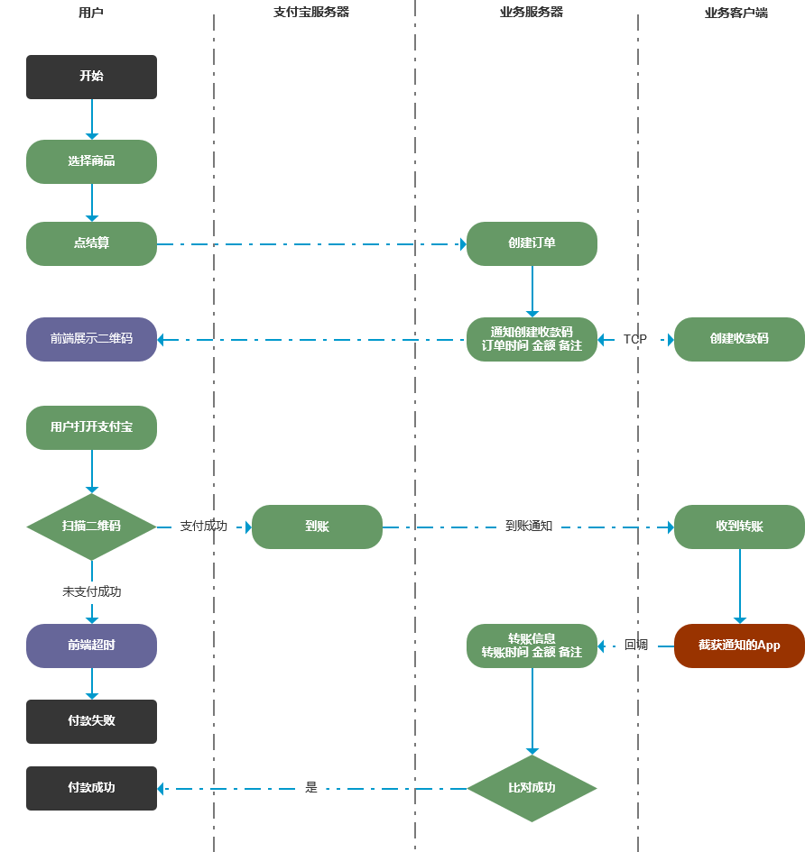

---
layout:		post
category:	"program"
title:		"微信支付宝个人收款解决方案之免签约支付解决方案之APP监控通知方案"
tags:		[android,微信,支付宝,支付,xposed]
---
- Content
{:toc}
**关键词**：免签约支付，免签约收款，支付宝收款，微信收款，个人免签约收款


# 背景

​	有做网赚或者在网上售卖个人小产品小服务的，需要进行收款，如果零星个别的收款可能直接走个人转账然后手动发货即可，但是一旦流程标准下来，量走起来之后，付款发货就需要自动化了，以提高人效。例如在网站上挂一个购买链接，用户点击后自动展示收款码，用户扫码付款后网站自动完成发货，是不是感觉很好？或者在APP里提供了付费功能，用户需要购买的时候，能够直接弹出支付宝（或微信）付款，完成付款后自动提供付费功能，是不是感觉很好？

​	本方案场景是针对「个人开发者」或其他「个人商家」的，后面简称**个人收款**方案。对于已经拥有公司的，直接签约支付宝或微信的支付功能即可。

​	个人收款总结下来有两类：**签约**和**免签约**。

- **签约方案**就是直接和支付宝或者微信签约，严格按照支付宝或微信的要求一步步来，完成签约后使用它们的官方接口即可。该方案比较稳定，但是如果售卖的商品属于灰色的话，很容易被「风控」禁用，毕竟使用的是人家的服务，很容易被管控。早期的时候可以直接个人签约，但是后来就不行了，个人必须用营业执照才行。这个方案前面一篇文章中介绍过了。
- **免签约方案**就是避开使用支付宝或微信的签约流程，自己搭建一套支付收款体系。


​	网上有很多集成了收款方案做的**聚合收款方案**，大家可以了解，但是这些大多是属于不正规的个人或小团队搭建的，因为涉及到资金汇款，这个风险很高，不建议实际使用。截止到目前为止，以前做调研收集到的一些网站已经打不开了，收集了一些权当做了解、借鉴、参考，后面专门整理一篇文章介绍下。


今天主要介绍**免签约**方案，支付方式以支付宝为例介绍，微信方案同理。该方案**不需要营业执照**，也**没有手续费零费率**，完全可控，引用网友的一句话：「营业执照是不可能，这辈子都不可能有的」。


# 方案

使用一台闲置的安卓手机专门用来做收款，收到付款时手机会有通知提示，对该通知进行监控，监控到后发送数据到服务器，服务器根据订单情况支付情况判断是否成功完成一轮下单支付操作，如果成功则自动发货。


详细的流程：

- 网页前端展示商品，用户浏览，满意后准备下单，前端调用服务端接口创建订单信息并同时展示收款码。
- 服务端在创建订单信息时，可以设置个有效时间，例如3分钟之内有效。
- 用户扫码付款，付款成功后，专门用来做收款的手机会到账通知，监听APP监控到后把数据POST给服务端。
- 服务端根据收款金额、标题、时间等信息，结合订单信息，查询时间最接近的一项，进行判断。
- 如果是订单完成支付，则自动发货。


收款码又分静态模式和动态模式，流程分别如下。


静态收款码是提前创建一批收款码二维码图片，预先存储在服务端，根据需要进行选取。




动态收款码的整体流程差不多，只不过二维码不用提前上传，自用动态创建。




方案需要在客户端和服务端同时搭建。


# 客户端

客户端主要准备一台专门用来收款的安卓手机，用来监控收款通知的APP（后简称APP）。通常该APP有两种实现方式，一种是利用xposed插件进行监控，一种是利用无障碍服务进行监控，推荐使用后者，安全性及稳定性要高一些。

## xposed插件监控

缺点是不安全，可能会有资金风险。

可以参考：[Xposed---支付宝收款、转账监控<已附上成品>](https://www.52pojie.cn/thread-867703-1-1.html)

```java
package com.yymjr.android.xposedpay;
 
import android.content.Context;
import android.os.Bundle;
import android.util.Log;
 
import de.robv.android.xposed.IXposedHookLoadPackage;
import de.robv.android.xposed.XC_MethodHook;
import de.robv.android.xposed.XposedHelpers;
import de.robv.android.xposed.callbacks.XC_LoadPackage;
 
public class MainHook implements IXposedHookLoadPackage {
    private final static String TAG = "XposedPay-MainHook";
    private Bundle PushNoticeDisplayBundle = null;
    private Class<?> PushNoticeDisplayClazz;
 
    @Override
    public void handleLoadPackage(XC_LoadPackage.LoadPackageParam lpparam) throws Throwable {
        if (!lpparam.packageName.equals("com.eg.android.AlipayGphone")) return;
        Log.d(TAG, "Hook alipay begin......");
        XposedHelpers.findAndHookMethod("com.alipay.mobile.quinox.LauncherApplication",lpparam.classLoader, "attachBaseContext", Context.class, new XC_MethodHook() {
            @Override
            protected void afterHookedMethod(MethodHookParam param) throws Throwable {
                super.afterHookedMethod(param);
                Log.d(TAG, "Hook attachBaseContext successful......" );
                ClassLoader classLoader = ((Context) param.args[0]).getClassLoader();
                try {
                    PushNoticeDisplayClazz = classLoader.loadClass("com.alipay.mobile.rome.pushservice.integration.d");
                    XposedHelpers.findAndHookConstructor(PushNoticeDisplayClazz, Context.class, Bundle.class, new XC_MethodHook() {
                        @Override
                        protected void afterHookedMethod(MethodHookParam param) throws Throwable {
                            super.afterHookedMethod(param);
                            Log.d(TAG, "Hook PushNoticeDispaly.d successful......");
                            PushNoticeDisplayBundle = (Bundle) param.args[1];
                            if (PushNoticeDisplayBundle == null) return;
                            LogPushNoticeDisplay("push_show_title");
                            LogPushNoticeDisplay("push_show_text");
                            JSONObject jsonObject_data = new JSONObject(PushNoticeDisplayBundle.getString("push_msg_data"));
                            JSONObject paramsJsonObject = jsonObject_data.getJSONObject("params");
                            Log.d(TAG, "订单："+paramsJsonObject.getString("tradeNO"));
                            JSONObject jsonObject_ext = new JSONObject(PushNoticeDisplayBundle.getString("push_show_ext"));
                            Log.d(TAG, "支付金额："+jsonObject_ext.getString("soundValue"));
                        }
                    });
                }catch (ClassNotFoundException e){
                    e.printStackTrace();
                }
            }
        });
    }
 
    private void LogPushNoticeDisplay(String PushExtConstants){
        Log.d(TAG, PushNoticeDisplayBundle.getString(PushExtConstants));
    }
 
    private void findAndHookMethod(Class clazz, String methodName, Object... parameterTypesAndCallback){
        XposedHelpers.findAndHookMethod(clazz, methodName, parameterTypesAndCallback);
    }
}
```

这个方案及代码我没有试过，即使失效也可以顺着这些关键词关键代码在网上继续搜索，一定能找到可用的插件模块的。


## 无障碍服务监控（推荐）

相比较xposed插件方案，安全性稳定性适配性更好一些，推荐这种做法。

可以参考：[receiptnotice: Push notification bar use your android phone to the specified URL](https://github.com/c-kzxvldkhX/receiptnotice)，因为是开源的，安全可靠一些，即使后期失效可以在这个基础上改进，或基于此继续搜索其他成熟的代码。


该方案也比较容易扩展到其他收款应用：

| 收款应用     | 包名                        |
| ------------ | --------------------------- |
| 支付宝       | com.eg.android.AlipayGphone |
| 工银商户之家 | com.icbc.biz.elife          |
| 银联云闪付   | com.unionpay                |


另外一个：[微信支付 支付宝免签约支付实现方法 个人微信支付 个人支付宝接口](https://segmentfault.com/a/1190000022064367)，[监控APP](https://www.coolapk.com/apk/com.cozylife.smshelper，该方案的演示：

- [微信监听支付](http://www.liketube.cn/test/wx_pay/pay.php)
- [支付宝监听支付](http://www.liketube.cn/test/wx_pay/alipay.php)
- [工行e支付监听支付](http://www.liketube.cn/test/wx_pay/ghpay.php)


# 服务端

可以借鉴参考客户端方案[receiptnotice: Push notification bar use your android phone to the specified URL](https://github.com/c-kzxvldkhX/receiptnotice)对应的服务端：[WeihuaGu/getreceipt-server at php](https://github.com/WeihuaGu/getreceipt-server/tree/php)


# 总结

​	该方案**不需要营业执照**，也**没有手续费零费率**，完全可控。使用起来也比较便捷，见过一个卖盗版资源、注册码的，就把一个html的说明页面（内含该资源的ID）和资源一起打包四处传播，资源是加密的，用户下载后打不开，打开说明网页提示需要付款，点击付款后就跳转到个人收款，付款成功会自动展示解密的密码或注册码（通过提交的资源ID来发送对应的结果）。虽然贩卖盗版资源、软件注册码的行为不可取，但是他把这个流程设计得很巧妙，自己不需要全程参与就能收到钱，也没有售后成本，自己所要做的就是继续复制这种模式，真正实现躺赚。